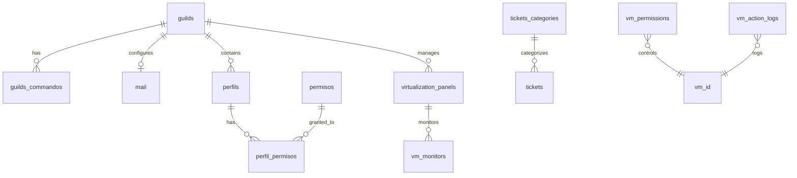

BotTroner uses [Prisma ORM](https://prisma.io) with MySQL to manage persistent data. The schema is designed to support multi-guild operations, virtualization management, ticket systems, and permissions.

## Database Configuration

```prisma prisma/schema.prisma:1-8
generator client {
  provider = "prisma-client"
  output   = "../generated/prisma"
}

datasource db {
  provider = "mysql"
}
```

<Info>
  The Prisma client is generated to `../generated/prisma` for better separation from source code.
</Info>

## Entity Relationship Diagram



## Core Models

### Guilds

The central model representing Discord servers.

```prisma prisma/schema.prisma:10-23
model guilds {
  id                    String                  @id @db.VarChar(25)
  lang                  String?                 @default("es-es") @db.VarChar(10)
  TicketChannel         String?                 @db.VarChar(30)
  TicketTranscripts     String?                 @db.VarChar(30)
  TicketMsg             String?                 @db.VarChar(30)
  TicketOpinions        String?                 @db.VarChar(30)
  proxmoxLogs           String?                 @db.VarChar(30)
  image                 String?                 @db.VarChar(250)
  mail                  mail?
  perfils               perfils[]
  virtualization_panels virtualization_panels[]
  guilds_commandos      guilds_commandos[]
}
```

<Accordion title="Guild Fields Explained">
  | Field | Type | Description |
  |-------|------|-------------|
  | `id` | String(25) | Discord guild ID (primary key) |
  | `lang` | String(10) | Default language code (defaults to "es-es") |
  | `TicketChannel` | String(30) | Channel ID for ticket creation |
  | `TicketTranscripts` | String(30) | Channel ID for ticket transcripts |
  | `TicketMsg` | String(30) | Message ID for ticket creation button |
  | `TicketOpinions` | String(30) | Channel ID for ticket feedback |
  | `proxmoxLogs` | String(30) | Channel ID for Proxmox action logs |
  | `image` | String(250) | Custom guild image URL |
</Accordion>

### Guilds Commandos

Manages per-guild command enablement.

```prisma prisma/schema.prisma:25-32
model guilds_commandos {
  guildId String  @db.VarChar(50)
  CommId  String  @db.VarChar(50)
  enabled Boolean @default(false)
  guilds  guilds  @relation(fields: [guildId], references: [id], onDelete: Cascade, onUpdate: NoAction, map: "FK_guilds_commandos_guilds")

  @@id([guildId, CommId])
}
```

<Note>
  Commands are disabled by default when added to a guild. Administrators must explicitly enable them through the sync system.
</Note>

**Use Case**: Allows guilds to selectively enable/disable specific bot commands.

## Permission System

### Perfils (Profiles)

Links Discord roles to permission sets.

```prisma prisma/schema.prisma:55-65
model perfils {
  id              Int               @id @default(autoincrement())
  name            String            @db.VarChar(30)
  guildId         String            @db.VarChar(30)
  roleId          String            @db.VarChar(30)
  perfil_permisos perfil_permisos[]
  guilds          guilds            @relation(fields: [guildId], references: [id], onDelete: Cascade, map: "FK1_guilds")

  @@index([guildId, name], map: "guildId")
  @@index([guildId, roleId], map: "guildId_roleId")
}
```

### Permisos (Permissions)

Defines available permissions in the system.

```prisma prisma/schema.prisma:67-72
model permisos {
  id              Int               @id @default(autoincrement())
  name            String            @db.VarChar(50)
  Descripcion     String?           @db.VarChar(255)
  perfil_permisos perfil_permisos[]
}
```

### Perfil Permisos (Profile Permissions)

Junction table linking profiles to permissions.

```prisma prisma/schema.prisma:45-53
model perfil_permisos {
  perfilId Int
  permId   Int
  perfils  perfils  @relation(fields: [perfilId], references: [id], onDelete: Cascade, map: "FK1_perfil")
  permisos permisos @relation(fields: [permId], references: [id], onDelete: Cascade, map: "FK2_perms")

  @@id([perfilId, permId])
  @@index([permId], map: "FK2_perm")
}
```

<Accordion title="Permission System Flow">
  ```mermaid
  flowchart LR
      Role[Discord Role] --> Profile[Perfil]
      Profile --> PP[perfil_permisos]
      PP --> Perm[permisos]
      Perm --> Action[Bot Action]
      
      User[Discord User] --> HasRole{Has Role?}
      HasRole -->|Yes| Profile
      HasRole -->|No| Denied[Access Denied]
  ```
  
  The system checks:
  1. User's Discord roles
  2. Which profiles (perfils) are linked to those roles
  3. Which permissions those profiles have
  4. Whether the action requires any of those permissions
</Accordion>

## Virtualization System

### Virtualization Panels

Manages connections to virtualization platforms (Proxmox, VMware, Hyper-V, etc.).

```prisma prisma/schema.prisma:74-95
model virtualization_panels {
  id          Int      @id @default(autoincrement()) @db.UnsignedInt
  guildId     String   @db.VarChar(30)
  name        String   @db.VarChar(50) // Nombre descriptivo del panel
  type        String   @db.VarChar(20) // 'proxmox', 'vmware', 'hyper-v', etc.
  apiUrl      String   @db.VarChar(255) // URL base de la API
  credentials Json // Credenciales encriptadas (token, user/pass, etc.)
  config      Json? // Configuración específica del tipo
  active      Boolean  @default(true)
  isDefault   Boolean  @default(false)
  createdAt   DateTime @default(now())
  updatedAt   DateTime @updatedAt

  // Relaciones
  guilds     guilds             @relation(fields: [guildId], references: [id], onDelete: Cascade)
  vmMonitors vm_monitors[]

  @@unique([guildId, name])
  @@index([guildId, type])
  @@index([guildId, isDefault])
}
```

<Accordion title="Panel Types and Configuration">
  **Supported Types**:
  - `proxmox` - Proxmox VE
  - `vmware` - VMware vSphere
  - `hyper-v` - Microsoft Hyper-V
  - More can be added through the extensible architecture

  **Credentials Format** (JSON):
  ```json
  {
    "type": "token",
    "token": "encrypted_api_token"
  }
  ```
  or
  ```json
  {
    "type": "user_pass",
    "username": "admin",
    "password": "encrypted_password"
  }
  ```

  **Config Format** (JSON - Platform specific):
  ```json
  {
    "node": "pve-node-1",
    "storage": "local-lvm",
    "timeout": 30000
  }
  ```
</Accordion>

### VM Monitors

Tracks Discord messages that monitor VM status.

```prisma prisma/schema.prisma:166-178
model vm_monitors {
  id        Int      @id @default(autoincrement())
  guildId   String   @db.VarChar(50)
  channelId String   @db.VarChar(50)
  messageId String   @unique @db.VarChar(50)
  panelId   Int      @db.UnsignedInt
  vmId      String   @db.VarChar(50)
  userId    String   @db.VarChar(50)
  createdAt DateTime @default(now())
  updatedAt DateTime @updatedAt

  panel virtualization_panels @relation(fields: [panelId], references: [id], onDelete: Cascade)
}
```

**Use Case**: BotTroner can create embed messages that auto-update with VM status. This model tracks which message monitors which VM.

### VM Action Logs

Audits all VM operations.

```prisma prisma/schema.prisma:97-110
model vm_action_logs {
  id         Int      @id @default(autoincrement())
  vmId       String   @db.VarChar(50)
  userId     String   @db.VarChar(25)
  action     String   @db.VarChar(50) // start, stop, restart, etc.
  status     String   @db.VarChar(20) // success, error, pending
  details    Json? // Detalles adicionales
  error      String?  @db.Text // Error message si falla
  executedAt DateTime @default(now())

  @@index([vmId, executedAt])
  @@index([userId, executedAt])
}
```

<Accordion title="Action Types">
  Common action values:
  - `start` - Start a VM
  - `stop` - Graceful stop
  - `shutdown` - Force shutdown
  - `restart` - Restart VM
  - `reset` - Force reset
  - `suspend` - Pause VM
  - `resume` - Resume from suspend
  - `snapshot` - Create snapshot
  - `console` - Access console

  Status values:
  - `success` - Operation completed successfully
  - `error` - Operation failed
  - `pending` - Operation in progress
</Accordion>

### VM Permissions

Granular permissions for VM access control.

```prisma prisma/schema.prisma:112-126
model vm_permissions {
  id          Int       @id @default(autoincrement())
  vmId        String    @db.VarChar(50)
  userId      String?   @db.VarChar(25) // Usuario específico
  roleId      String?   @db.VarChar(25) // O rol de Discord
  permissions Json // Array de permisos: ['start', 'stop', 'restart', 'console', 'stats']
  grantedBy   String    @db.VarChar(25) // Quien otorgó los permisos
  grantedAt   DateTime  @default(now())
  expiresAt   DateTime? // Opcional: permisos temporales

  @@index([vmId])
  @@index([userId])
  @@index([roleId])
}
```

**Permissions Array Format** (JSON):
```json
["start", "stop", "restart", "console", "stats"]
```

<Note>
  Permissions can be granted to either a specific user (`userId`) or a Discord role (`roleId`), but not both simultaneously.
</Note>

## Ticket System

### Tickets

Tracks support tickets created by users.

```prisma prisma/schema.prisma:128-143
model tickets {
  id                 Int                @id @default(autoincrement())
  guildId            String             @db.VarChar(25)
  channelId          String             @db.VarChar(25)
  usrId              String             @db.VarChar(25)
  category           Int
  transcript         String?            @db.Text
  closed             Boolean            @default(false)
  CreatedAt          DateTime           @default(now()) @db.Timestamp(0)
  tickets_categories tickets_categories @relation(fields: [category], references: [id], onUpdate: Restrict, map: "FK1_categorias")

  @@index([category], map: "FK1_categorias")
  @@index([channelId], map: "channelId")
  @@index([guildId], map: "guildId")
  @@index([usrId], map: "usrId")
}
```

### Ticket Categories

Organizes tickets into categories (e.g., "Technical Support", "Billing", "General").

```prisma prisma/schema.prisma:145-154
model tickets_categories {
  id          Int       @id @default(autoincrement())
  guildId     String    @db.VarChar(25)
  name        String    @db.VarChar(30)
  description String    @db.VarChar(100)
  CategId     String?   @db.VarChar(25)
  tickets     tickets[]

  @@index([guildId], map: "guildId")
}
```

<Accordion title="Ticket Workflow">
  ```mermaid
  stateDiagram-v2
      [*] --> Created: User clicks button
      Created --> Active: Channel created
      Active --> Responding: Staff responds
      Responding --> Active: User responds
      Active --> Closed: Staff closes
      Closed --> Transcript: Generate transcript
      Transcript --> [*]
  ```

  1. User clicks ticket creation button
  2. Bot creates ticket record in database
  3. Bot creates private channel (`channelId`)
  4. Conversation happens in channel
  5. Staff member closes ticket
  6. Bot generates transcript and saves to `transcript` field
  7. Channel is deleted
</Accordion>

## Mail Configuration

Stores SMTP settings for email functionality.

```prisma prisma/schema.prisma:34-43
model mail {
  guildId   String  @id @db.VarChar(30)
  host      String? @db.VarChar(30)
  port      Int     @default(465)
  secure    Int     @default(1) @db.TinyInt
  loginType String  @db.VarChar(50)
  loginUser String  @default("") @db.VarChar(255)
  loginPass String  @default("") @db.VarChar(255)
  guilds    guilds  @relation(fields: [guildId], references: [id], onUpdate: Restrict, map: "FK1_guild")
}
```

<Warning>
  Passwords stored in `loginPass` should be encrypted at the application level before storing in the database.
</Warning>

## Translations System

Stores multi-language translations for internationalization.

```prisma prisma/schema.prisma:156-164
model traducciones {
  id    Int    @id @default(autoincrement())
  lang  String @default("") @db.VarChar(5)
  key   String @default("") @db.VarChar(255)
  value String @db.LongText

  @@unique([lang, id], map: "lang")
  @@index([lang], map: "lang_index")
}
```

**Translation Lookup Example**:
```typescript
const translation = await prisma.traducciones.findFirst({
  where: {
    lang: "en-us",
    key: "welcome_message"
  }
});
```

<Accordion title="Supported Languages">
  Common language codes:
  - `es-es` - Spanish (Spain)
  - `en-us` - English (United States)
  - `en-gb` - English (United Kingdom)
  - `fr-fr` - French (France)
  - `de-de` - German (Germany)
  - `pt-br` - Portuguese (Brazil)

  Translations are loaded at startup via `loadTranslations()` in src/class/extendClient.ts:104
</Accordion>

## Database Access

The Prisma client is accessed through the ExtendedClient:

```typescript
import { prisma } from "@class/prismaClient";

// Or via ExtendedClient
const client = new ExtendedClient();
const guilds = await client.prisma.guilds.findMany();
```

### Common Query Patterns

<CodeGroup>
```typescript Find Guild with Relations
const guild = await prisma.guilds.findUnique({
  where: { id: guildId },
  include: {
    mail: true,
    perfils: true,
    virtualization_panels: true,
    guilds_commandos: {
      where: { enabled: true }
    }
  }
});
```

```typescript Create VM Monitor
const monitor = await prisma.vm_monitors.create({
  data: {
    guildId: guild.id,
    channelId: channel.id,
    messageId: message.id,
    panelId: panel.id,
    vmId: vmId,
    userId: user.id
  }
});
```

```typescript Log VM Action
await prisma.vm_action_logs.create({
  data: {
    vmId: vmId,
    userId: user.id,
    action: "start",
    status: "success",
    details: {
      node: "pve-node-1",
      time: Date.now()
    }
  }
});
```

```typescript Check VM Permissions
const permission = await prisma.vm_permissions.findFirst({
  where: {
    vmId: vmId,
    OR: [
      { userId: user.id },
      { roleId: { in: user.roles.cache.map(r => r.id) } }
    ]
  }
});

const canStart = permission?.permissions.includes("start");
```
</CodeGroup>

## Indexes and Performance

<Accordion title="Key Indexes">
  The schema includes strategic indexes for query optimization:

  **Ticket Queries**:
  - `tickets(guildId)` - Find all tickets in a guild
  - `tickets(channelId)` - Look up ticket by channel
  - `tickets(usrId)` - Find user's tickets

  **VM Operations**:
  - `vm_action_logs(vmId, executedAt)` - VM action history
  - `vm_action_logs(userId, executedAt)` - User action history
  - `vm_permissions(vmId)` - VM permission lookup
  - `vm_permissions(userId)` - User's VM permissions
  - `vm_permissions(roleId)` - Role-based VM permissions

  **Virtualization**:
  - `virtualization_panels(guildId, type)` - Find panels by type
  - `virtualization_panels(guildId, isDefault)` - Find default panel

  **Permissions**:
  - `perfils(guildId, name)` - Profile lookup by name
  - `perfils(guildId, roleId)` - Profile lookup by role
</Accordion>

## Migration Workflow

To modify the schema:

1. Edit `prisma/schema.prisma`
2. Create migration:
   ```bash
   bun prisma migrate dev --name descriptive_name
   ```
3. Apply to production:
   ```bash
   bun prisma migrate deploy
   ```
4. Regenerate client:
   ```bash
   bun prisma generate
   ```

<Warning>
  Always backup your database before running migrations in production.
</Warning>

## Best Practices

<CardGroup cols={2}>
  <Card title="Use Transactions" icon="arrow-right-arrow-left">
    Wrap related operations in `prisma.$transaction()` for data consistency
  </Card>
  <Card title="Encrypt Sensitive Data" icon="lock">
    Always encrypt credentials, passwords, and tokens before storing
  </Card>
  <Card title="Cascade Deletes" icon="trash-cascade">
    Leverage `onDelete: Cascade` to maintain referential integrity
  </Card>
  <Card title="Index Strategically" icon="magnifying-glass">
    Add indexes on fields used in WHERE clauses and JOINs
  </Card>
</CardGroup>

## Next Steps

<CardGroup cols={2}>
  <Card title="Architecture Overview" icon="sitemap" href="/architecture/overview">
    Return to the architecture overview
  </Card>
  <Card title="Modular System" icon="boxes-stacked" href="/architecture/modular-system">
    Learn about the loader system
  </Card>
</CardGroup>