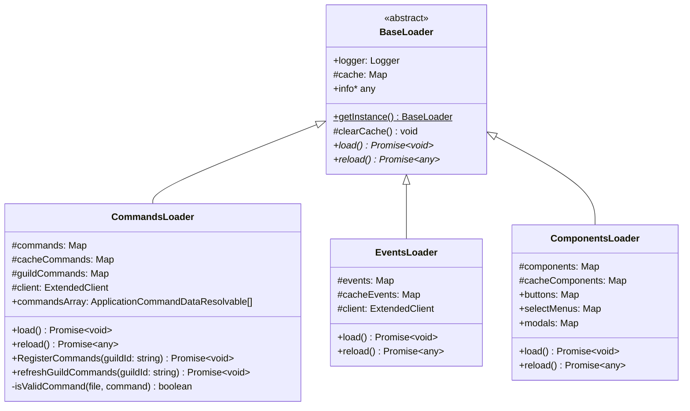
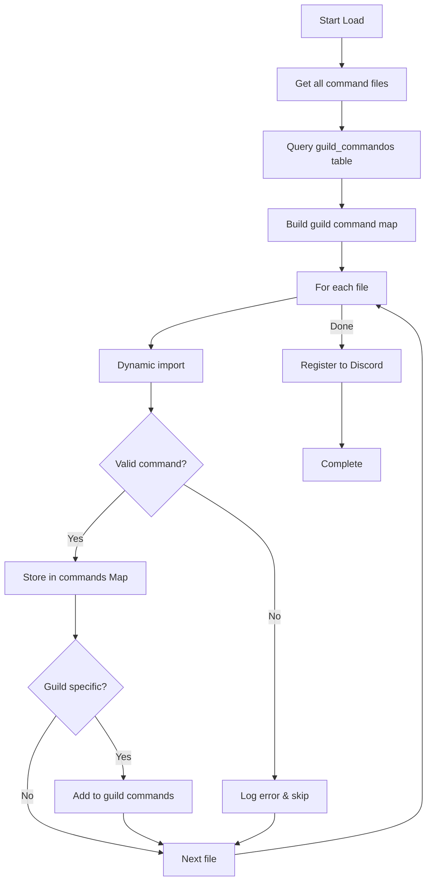

BotTroner's loader system is the foundation of its modular architecture. It automatically discovers and loads commands, events, and UI components from the filesystem, enabling hot-reloading and dynamic feature management.

## Loader Architecture

All loaders inherit from the `BaseLoader` abstract class, which provides common functionality:

```typescript src/class/loaders/base.ts
export abstract class BaseLoader {
    public logger: Logger;
    #cache: Map<string, string> = new Map();
    protected static singleTone: any;

    constructor(loaderName: string = "BaseLoader") {
        this.logger = logger.child({module: loaderName});
    }

    public static getInstance(): BaseLoader {
        if (!this.singleTone) {
            throw new Error("getInstance() must be implemented in the derived class.");
        }
        return this.singleTone;
    };

    protected clearCache() {
        this.#cache.forEach((file, name) => {
            delete require.cache[require.resolve(file)];
            this.logger.info(`Cache for command ${name} cleared.`);
        });
    }

    public abstract get info(): any;
    public abstract load(): Promise<void>;
    public abstract reload(): Promise<any>;
}
```

<Info>
  The BaseLoader implements the **Singleton pattern** to ensure only one instance of each loader exists at runtime.
</Info>

## Loader Types



## File Discovery System

All loaders use the `getFiles()` utility function to recursively scan directories:

```typescript src/utils/file.ts
export const getFiles = (folderName: AllFolders, recursive = true): string[] => {
    if (!folderExist(folderName)) {
        throw new Error(`Folder ${folderName} does not exist`);
    }
    let allFiles: string[] = [];
    const folder = fs.readdirSync(`./src/${folderName}/`);
    const files = folder.map((file) => {
        const info = fs.statSync(`./src/${folderName}/${file}`);
        if (info.isFile()) {
            return `@src/${folderName}/${file}`;
        } else if (info.isDirectory() && recursive) {
            const childPath = `${folderName}/${file}` as AllFolders;
            const subfolder = getFiles(childPath);
            allFiles.push(...subfolder);
        }
    }).filter((file) => file !== undefined);

    allFiles.push(...files);
    return allFiles;
}
```

<Note>
  The function uses the `@src` path alias for clean imports and supports recursive directory traversal.
</Note>

## CommandsLoader

The CommandsLoader handles slash command registration and management with per-guild customization.

### Loading Process



### Command Loading Implementation

```typescript src/class/loaders/Commands.ts:107-176
public async load(): Promise<void> {
    const start = performance.now();
    const files = getFiles("commands");

    // Query enabled commands per guild from database
    const guildsCommandsRaw = await this.#client.prisma.guilds_commandos.findMany({
        where: { enabled: true },
        select: { guildId: true, CommId: true }
    });

    // Build a map of guild -> command IDs
    const guildsCommandsMap = new Map<string, string[]>();
    guildsCommandsRaw.forEach(record => {
        if (!guildsCommandsMap.has(record.guildId)) {
            guildsCommandsMap.set(record.guildId, []);
        }
        guildsCommandsMap.get(record.guildId)!.push(record.CommId);
    });

    // Convert to Set for efficient lookup
    const guildsCommands = Array.from(guildsCommandsMap.entries()).map(([guildId, commIds]) => ({
        guildId,
        CommId: commIds.join(","),
        commands: new Set(commIds.map(cmd => cmd.trim()))
    }));

    // Load each command file
    for (const file of files) {
        try {
            const commandImport = (await import(`${file}`));
            if (!commandImport || !commandImport.default) {
                this.logger.error(`No default export in ${file}`);
                continue;
            }
            const command: CommandBuilder = commandImport.default;
            if (this.isValidCommand(file, command)) {
                if (!this.#commands.has(command.name)) 
                    this.#commands.set(command.name, command);
                if (!this.#cacheCommands.has(command.name)) 
                    this.#cacheCommands.set(command.name, file);
                
                // Map command to guilds that have it enabled
                if (guildsCommands.length > 0) {
                    guildsCommands.forEach(guild => {
                        if (guild.commands?.has(command.name)) {
                            if (!this.#guildCommands.has(guild.guildId)) {
                                this.#guildCommands.set(guild.guildId, new Set());
                            }
                            this.#guildCommands.get(guild.guildId)?.add(command.name);
                        }
                    });
                }
            }
            this.logger.debug(`Loaded command: ${command.name}`);
        } catch (err) {
            this.logger.error(err, `Error importing file: ${file}`);
        }
    }

    const end = performance.now();
    this.logger.info(`Loaded ${files.length} commands in ${(end - start).toFixed(2)}ms`);
}
```

### Command Validation

Before a command is loaded, it must pass validation:

```typescript src/class/loaders/Commands.ts:48-66
private isValidCommand(file: string, command: CommandBuilder): boolean {
    if (!command.enabled) {
        this.logger.warn(`command in ${file} is disabled.`);
        return false;
    }
    if (!command.name) {
        this.logger.error(`command in ${file} has no name.`);
        return false;
    }
    if (!command.description) {
        this.logger.warn(`command ${command.name} doesn't have description`);
        return false;
    }
    if (!command.runner) {
        this.logger.error(`command ${command.name} doesn't have run code to execute`);
        return false;
    }
    return true;
}
```

### Command Structure Example

```typescript src/commands/basic/ping.ts
import { MessageFlags} from "discord.js";
import { CommandBuilder } from "@class/builders/CommandBuilder";
import { _U, getGuildLang } from "@src/utils/translate";

const command = new CommandBuilder();

command.setName("ping")
    .setDescription("comando que te envia el ping del bot")

command.runner = async ({client, interaction}) => {
    const discordLang = await getGuildLang(interaction.guildId!, client);
    const start = interaction.createdTimestamp;
    let msg = "";

    try {
        msg = await _U(discordLang, "pingMsg", {
            clientPing: `${client.ws.ping}`,
            ping: `${Date.now() - start}`
        });
    } catch (err) {
        msg = `Pong! : ${client.ws.ping}ms. Latencia: ${Date.now() - start}ms`;
    }
    await interaction.reply({
        content: msg,
        flags: MessageFlags.Ephemeral
    });
}

export default command
```

<Accordion title="Per-Guild Command Registration">
  BotTroner supports enabling/disabling commands per guild:

  ```typescript src/class/loaders/Commands.ts:68-82
  public async RegisterCommands(guildId: string): Promise<void> {
      const guild = await this.#client.guilds.fetch(guildId).catch(() => null);
      if (!guild) {
          this.logger.error(`Guild with ID ${guildId} not found.`);
          return;
      }
      let commands = this.commandsArray;
      if (this.#guildCommands.has(guildId)) {
          commands = Array.from(this.#commands.values())
              .filter(cmd => this.#guildCommands.get(guildId)?.has(cmd.name))
              .map(cmd => cmd.toJSON());
      }
      guild.commands.set(commands);
      this.logger.debug(`Registered ${commands.length} commands to guild ${guildId}`);
  }
  ```
</Accordion>

## EventsLoader

The EventsLoader registers Discord.js event listeners automatically.

### Loading Process

```typescript src/class/loaders/events.ts:28-54
public async load(): Promise<void> {
    const start = performance.now();
    const files = getFiles("events");
    for (const file of files) {
        const event = (await import(`${file}`));
        this.#cacheEvents.set(event.name, file);
        if (!event || !event.name) {
            this.logger.error(`event in ${file} is not valid.`);
            continue;
        }
        if (!event.active) {
            this.logger.info(`event ${event.name} is disabled.`);
            continue;
        }
        this.#events.set(event.name, event);
        if (event.once) {
            this.#client.once(event.name, event.run);
            this.logger.debug(`event once ${event.name} loaded.`);
        } else {
            this.#client.on(event.name, (...args) => event.run(...args, this.#client));
            this.logger.debug(`event on ${event.name} loaded.`);
        }
    }

    const end = performance.now();
    this.logger.info(`Loaded ${this.#events.size} events in ${(end - start).toFixed(2)}ms`);
}
```

### Event Structure Example

```typescript src/events/basic/interactionCreate.ts
import { handleInteraction} from "@handlers/interactions"
import type { ExtendedClient } from "@src/class/extendClient";
import { Events, type Interaction } from "discord.js"

export const name = Events.InteractionCreate;
export const once = false
export const active = true

export const run = async (interaction: Interaction, client: ExtendedClient) => {
    await handleInteraction(interaction, client);
}
```

<Info>
  Events use named exports (`name`, `once`, `active`, `run`) rather than default exports for cleaner module structure.
</Info>

### Event Properties

| Property | Type | Description |
|----------|------|-------------|
| `name` | `Events` | Discord.js event name (e.g., `Events.ClientReady`) |
| `once` | `boolean` | Whether the event should fire only once |
| `active` | `boolean` | Whether the event is enabled |
| `run` | `function` | The event handler function |

## ComponentsLoader

The ComponentsLoader manages UI components (buttons, select menus, modals).

### Loading Process

```typescript src/class/loaders/components.ts:56-72
public async load(): Promise<void> {
    const start = performance.now();
    const files = getFiles("components");
    for (const file of files) {
        const component = (await import(`${file}`));
        if (!component || !component.data?.name) {
            this.logger.error(`component in ${file} is not valid.`);
            continue;
        }
        const customId = component.data.name;
        this.#components.set(customId, component);
        this.#cacheComponents.set(customId, file);
        this.logger.debug(`component ${customId} loaded.`);
    }
    const end = performance.now();
    this.logger.info(`Loaded ${this.#components.size} components in ${(end - start).toFixed(2)}ms`);
}
```

### Type-Specific Getters

Components are categorized by type for easy access:

```typescript src/class/loaders/components.ts:18-46
get buttons() {
    const buttons = new Map<string, any>();
    for (const [key, component] of this.#components) {
        if (component.type === "button") {
            buttons.set(key, component);
        }
    }
    return buttons;
}

get selectMenus() {
    const selectMenus = new Map<string, any>();
    for (const [key, component] of this.#components) {
        if (component.type === "selectmenu") {
            selectMenus.set(key, component);
        }
    }
    return selectMenus;
}

get modals() {
    const modals = new Map<string, any>();
    for (const [key, component] of this.#components) {
        if (component.type === "modals") {
            modals.set(key, component);
        }
    }
    return modals;
}
```

## Hot Reloading

All loaders support hot reloading without restarting the bot:

```typescript
public async reload() {
    this.clearCache();        // Clear module cache
    this.#commands.clear();    // Clear loaded commands
    this.#cacheCommands.clear(); // Clear file paths
    await this.load();         // Reload everything
    return this.commandsArray;
}
```

<Warning>
  Hot reloading clears Node.js's require cache to ensure module changes are picked up. This is safe but should be used carefully in production.
</Warning>

## Performance Metrics

Loaders track and log loading performance:

```typescript
const start = performance.now();
// ... loading logic ...
const end = performance.now();
this.logger.info(`Loaded ${files.length} commands in ${(end - start).toFixed(2)}ms`);
```

Typical loading times:
- Commands: 50-200ms depending on count
- Events: 10-50ms (fewer files)
- Components: 20-100ms

## Best Practices

<CardGroup cols={2}>
  <Card title="Validation First" icon="circle-check">
    Always validate modules before storing them in collections
  </Card>
  <Card title="Error Handling" icon="triangle-exclamation">
    Log import errors but continue loading other modules
  </Card>
  <Card title="Cache Management" icon="memory">
    Use cache maps to enable hot reloading functionality
  </Card>
  <Card title="Singleton Pattern" icon="circle-1">
    Ensure only one loader instance exists per type
  </Card>
</CardGroup>

## Next Steps

<CardGroup cols={2}>
  <Card title="Architecture Overview" icon="sitemap" href="/architecture/overview">
    Return to the architecture overview
  </Card>
  <Card title="Database Schema" icon="database" href="/architecture/database-schema">
    Learn about the Prisma database models
  </Card>
</CardGroup>