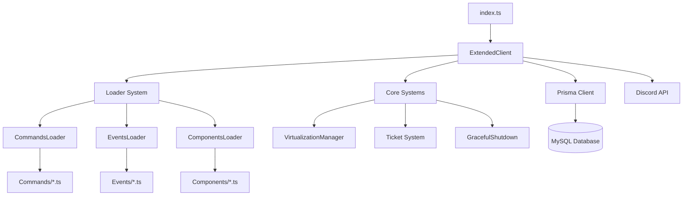
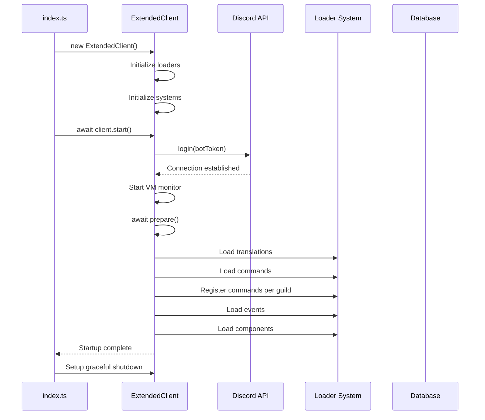

BotTroner is built with a modular, extensible architecture that emphasizes separation of concerns and maintainability. The bot leverages modern JavaScript tools and best practices to create a robust Discord bot platform.

## Technology Stack

BotTroner is built on a modern technology stack:

- **Runtime**: [Bun](https://bun.sh) - Fast JavaScript runtime with native TypeScript support
- **Language**: TypeScript - Type-safe development with enhanced developer experience
- **Discord Library**: [Discord.js v14](https://discord.js.org) - Powerful Discord API wrapper
- **Database**: [Prisma ORM](https://prisma.io) - Type-safe database client with MySQL
- **Logging**: Pino - High-performance structured logging

## Architecture Diagram



## Core Components

### Entry Point

The application starts in `src/index.ts`, which initializes the `ExtendedClient` and begins the startup sequence:

```typescript src/index.ts
import { ExtendedClient } from "@class/extendClient";
import { GracefulShutdown } from "./class/gracefulShutdown";

export const start = Date.now();
export const client = new ExtendedClient();

await client.start();

client.logger.info("bot started in " + (Date.now() - start) + "ms");

// Setup graceful shutdown handling
GracefulShutdown.setup(client);
```

### ExtendedClient

The `ExtendedClient` class extends Discord.js's base `Client` class and serves as the central hub for all bot functionality. It manages:

<Accordion title="Client Initialization">
  The client is initialized with specific Discord Gateway Intents:

  ```typescript src/class/extendClient.ts:26-39
  constructor() {
      super({
          intents: [
              GatewayIntentBits.Guilds,
              GatewayIntentBits.GuildMessages,
              GatewayIntentBits.MessageContent,
              GatewayIntentBits.GuildMembers,
              GatewayIntentBits.GuildVoiceStates,
              GatewayIntentBits.GuildPresences,
              GatewayIntentBits.GuildInvites,
              GatewayIntentBits.GuildIntegrations,
              GatewayIntentBits.GuildModeration,
              GatewayIntentBits.DirectMessages,
          ]
      });
  ```
</Accordion>

<Accordion title="Loader System Integration">
  The client initializes all three loaders during construction:

  ```typescript src/class/extendClient.ts:42-44
  this.commandsLoader = new CommandsLoader(this);
  this.eventsLoader = new EventsLoader(this);
  this.componentsLoader = new ComponentsLoader();
  ```
</Accordion>

<Accordion title="Core Systems">
  Additional systems are initialized for specialized functionality:

  - **VirtualizationManager**: Manages VM operations (Proxmox, VMware, etc.)
  - **VirtualizationMonitor**: Monitors VM status and updates
  - **Ticket System**: Handles support ticket creation and management
  - **Announcements**: Manages pending announcement messages

  ```typescript src/class/extendClient.ts:45-50
  this.virtualizationManager = new VirtualizationManager(this.#prisma);
  this.virtualizationManager.monitor = new VirtualizationMonitor(this, this.virtualizationManager);
  this.ticketSystem = new Tickets(this);
  this.pendingAnnouncements = new Map();
  ```
</Accordion>

## Startup Sequence

The bot follows a specific startup sequence to ensure all components are initialized correctly:



### Preparation Phase

The `prepare()` method orchestrates the loading of all bot features:

```typescript src/class/extendClient.ts:103-113
async prepare() {
    await loadTranslations();
    await this.commandsLoader.load();
    await Promise.all(
        this.guilds.cache.map(guild => {
            return this.commandsLoader.RegisterCommands(guild.id);
        })
    );
    await this.eventsLoader.load();
    await this.componentsLoader.load();
}
```

<Note>
  Commands are registered per guild in parallel for optimal performance. This allows each guild to have custom command configurations.
</Note>

## Graceful Shutdown

BotTroner implements comprehensive graceful shutdown handling to ensure clean termination:

```typescript src/class/extendClient.ts:74-101
async shutdown() {
    this.logger.info("Shutting down...");

    try {
        // Disconnect from virtualization panels
        this.virtualizationManager.monitor?.stop();
        await this.virtualizationManager.disconnectAll();
        this.logger.debug("Virtualization panels disconnected.");

        // Disconnect from Prisma
        await this.#prisma.$disconnect();
        this.logger.debug("Prisma disconnected.");

        // Destroy Discord client connection
        this.destroy();
        this.logger.debug("Client destroyed.");

        // Give some time for cleanup
        setTimeout(() => {
            this.logger.debug("Graceful shutdown completed.");
            process.exit(0);
        }, 100);

    } catch (error) {
        this.logger.error({ error }, "Error during shutdown");
        process.exit(1);
    }
}
```

<Warning>
  The shutdown sequence is critical for preventing data loss and ensuring all connections are properly closed before process termination.
</Warning>

## Accessor Methods

The `ExtendedClient` provides convenient accessor methods for retrieving loaded resources:

```typescript src/class/extendClient.ts:115-141
get commands() {
    return this.commandsLoader.info;
}

get components() {
    return this.componentsLoader.info;
}

get buttons() {
    return this.componentsLoader.buttons;
}

get modals() {
    return this.componentsLoader.modals;
}

get selectMenus() {
    return this.componentsLoader.selectMenus;
}

get virtualization() {
    return this.virtualizationManager;
}

get announcements() {
    return this.pendingAnnouncements;
}
```

These getters provide type-safe access to bot resources throughout the application.

## Design Principles

<CardGroup cols={2}>
  <Card title="Modularity" icon="cube">
    Each feature is isolated in its own module with clear interfaces
  </Card>
  <Card title="Type Safety" icon="shield-check">
    Full TypeScript coverage ensures compile-time error detection
  </Card>
  <Card title="Extensibility" icon="puzzle-piece">
    Loader system allows easy addition of new commands, events, and components
  </Card>
  <Card title="Performance" icon="gauge-high">
    Bun runtime and efficient loading strategies ensure fast startup
  </Card>
</CardGroup>

## Next Steps

<CardGroup cols={2}>
  <Card title="Modular System" icon="boxes-stacked" href="/architecture/modular-system">
    Learn how the loader system dynamically loads bot features
  </Card>
  <Card title="Database Schema" icon="database" href="/architecture/database-schema">
    Explore the Prisma database schema and data models
  </Card>
</CardGroup>